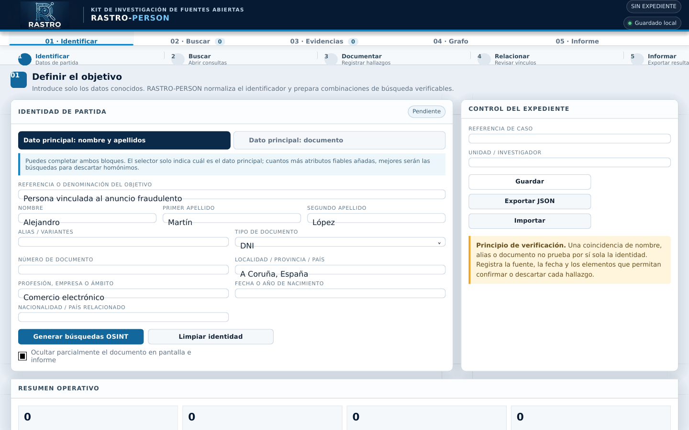
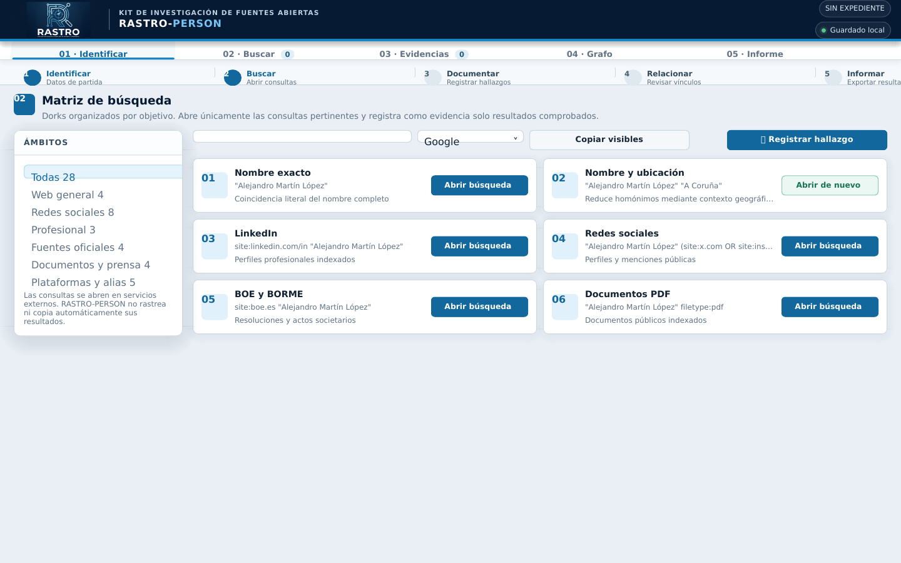
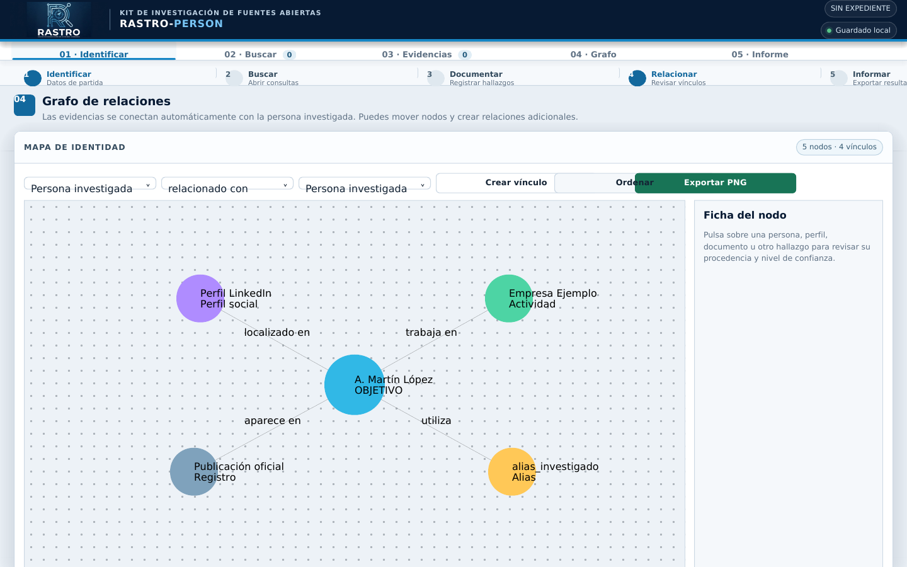

# RASTRO-PERSON

**RASTRO-PERSON** es un módulo del **Kit RASTRO** para organizar investigaciones OSINT sobre personas a partir de un nombre, apellidos, alias o documento de identidad.

Enlace a la herramienta: https://s3gad3.github.io/rastro-person/

La herramienta genera consultas dirigidas, permite documentar los hallazgos, representa las relaciones en un grafo y produce un informe exportable. Todo el tratamiento del expediente se realiza en el navegador.

> Una coincidencia nominal o documental no acredita por sí sola una identidad. RASTRO-PERSON es una herramienta de apoyo al análisis y requiere verificación humana y contextual.



Las capturas utilizan datos ficticios preparados únicamente para mostrar el flujo de trabajo.

## Valor operativo para el investigador

En una investigación por nombre es habitual abrir decenas de búsquedas, perder el contexto de cada resultado y terminar mezclando información de homónimos. RASTRO-PERSON ayuda a convertir esa búsqueda dispersa en un procedimiento reproducible:

1. **Estructura los datos de partida.** Separa nombre, apellidos, alias, documento, ubicación, actividad y fecha de nacimiento.
2. **Genera búsquedas con contexto.** Prepara dorks agrupados por finalidad y permite ejecutarlos con diferentes buscadores.
3. **Reduce falsos positivos.** Obliga a registrar los atributos coincidentes, la fuente, la fecha y el nivel de confianza.
4. **Conserva la trazabilidad.** Cada hallazgo puede incluir URL, fuente y observaciones para su revisión posterior.
5. **Facilita la lectura del caso.** El grafo muestra visualmente perfiles, identificadores, empresas, ubicaciones y otros vínculos.
6. **Acelera la documentación.** Genera un informe coherente a partir de la información registrada por el investigador.

## Funciones principales

### Identificación y normalización

- Investigación por nombre y apellidos, documento o ambos.
- Validación local de DNI y NIE mediante su letra de control.
- Campo de alias y variantes conocidas.
- Contexto geográfico, profesional, nacionalidad y fecha de nacimiento.
- Ocultación parcial del documento en pantalla e informes.

### Matriz de búsquedas OSINT

- Búsqueda general y combinaciones para reducir homónimos.
- LinkedIn, Facebook, Instagram, X/Twitter, TikTok y YouTube.
- BOE, BORME, contratación pública y boletines oficiales.
- Prensa, hemerotecas, PDF y documentos ofimáticos indexados.
- GitHub, foros y otras plataformas relacionadas con alias.
- Google, Bing, DuckDuckGo y Yandex.
- Historial local de las consultas abiertas.



### Cuaderno de evidencias

Cada hallazgo puede registrar:

- tipo de dato;
- valor o título;
- URL o localizador;
- fuente y fecha de consulta;
- relación con el objetivo;
- elementos de coincidencia;
- observaciones y posibles descartes;
- nivel de confianza declarado.

### Grafo de relaciones

- Creación automática del nodo central de la persona investigada.
- Nodos diferenciados por tipo de hallazgo.
- Relaciones automáticas y vínculos cruzados personalizados.
- Reordenación y desplazamiento manual de nodos.
- Ficha de detalle de cada elemento.
- Exportación del grafo a PNG.



### Informe y exportaciones

- Informe automático en HTML y TXT.
- Impresión o guardado como PDF mediante el navegador.
- Copia del informe al portapapeles.
- Exportación e importación del expediente completo en JSON.
- Guardado local automático mediante `localStorage`.

## Uso rápido

1. Descarga el repositorio o el archivo `index.html`.
2. Abre `index.html` con un navegador actualizado.
3. Introduce, como mínimo, un nombre con apellido o un documento válido.
4. Añade contexto para ayudar a diferenciar homónimos.
5. Pulsa **Generar búsquedas OSINT**.
6. Ejecuta únicamente las consultas pertinentes.
7. Registra como evidencia solo los resultados que hayas comprobado.
8. Revisa el grafo y crea vínculos adicionales cuando sea necesario.
9. Genera el informe y exporta el expediente JSON como copia de trabajo.

No requiere instalación, servidor, cuenta de usuario ni claves API.

## Privacidad y seguridad

- El expediente se procesa en el equipo del investigador.
- No existe un servidor propio de RASTRO-PERSON.
- No se incorporan cookies, tokens, credenciales ni claves API.
- Las búsquedas se abren de forma explícita en servicios externos elegidos por el usuario.
- La herramienta no realiza scraping ni extracción automática de resultados.
- Los datos permanecen en el almacenamiento local del navegador hasta que se elimina o sustituye el expediente.

Al abrir una búsqueda externa se aplican las condiciones y políticas de privacidad de ese servicio.

## Límites metodológicos

- Un mismo nombre puede corresponder a varias personas.
- Un alias puede ser compartido, reciclado o suplantado.
- Una URL indexada puede estar desactualizada.
- La puntuación de consistencia pondera cantidad, diversidad y confianza declarada; **no es una identificación biométrica, pericial ni jurídica**.
- La ausencia de resultados no demuestra la inexistencia de información.

El investigador debe contrastar cada dato, documentar los descartes y conservar las evidencias conforme a la normativa y los procedimientos aplicables.

## Compatibilidad

Probado para navegadores modernos basados en Chromium y Firefox. Algunas funciones, como el portapapeles o la apertura de nuevas pestañas, pueden depender de los permisos del navegador.

## Estructura

```text
RASTRO-PERSON/
├── index.html
├── README.md
├── LICENSE
├── CHANGELOG.md
└── docs/
    └── images/
        ├── 01-identificacion.png
        ├── 02-busquedas.png
        └── 03-grafo.png
```

## Autoría

Creado por **S3GAD3** como parte del **Kit RASTRO — Kit de investigación de fuentes abiertas**.

## Licencia

Este proyecto se publica bajo licencia [MIT](LICENSE).
